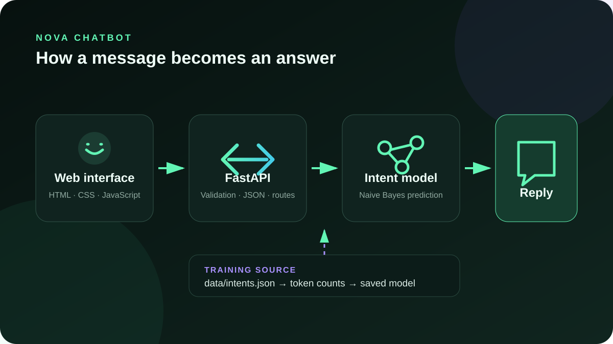
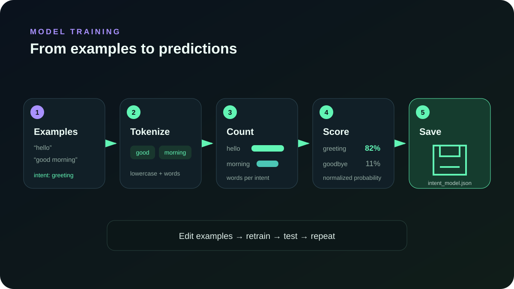

# Nova — a trainable Python chatbot

Nova is a complete beginner-friendly chatbot. It learns to classify messages
into intents from examples, chooses an appropriate response, exposes a FastAPI
API, and includes a polished browser interface.

It runs locally and requires no API key. This is a focused educational model,
not an AGI or a large language model.



## 1. Run it

Python 3.10 or newer is recommended.

```bash
cd chatbot
python3 -m venv .venv
source .venv/bin/activate
python -m pip install -r requirements.txt
python train.py
uvicorn app:app --reload
```

Open <http://127.0.0.1:8000>. Interactive API documentation is available at
<http://127.0.0.1:8000/docs>.

## 2. Chat through the API

```bash
curl -X POST http://127.0.0.1:8000/api/chat \
  -H 'Content-Type: application/json' \
  -d '{"message":"How can I train you?"}'
```

Example response:

```json
{
  "reply": "Add patterns and responses to data/intents.json, then run `python train.py`. Restart the server after training.",
  "intent": "training",
  "confidence": 0.9832
}
```

## 3. Teach it something new

Open `data/intents.json` and add an intent:

```json
{
  "tag": "opening_hours",
  "patterns": [
    "When are you open?",
    "What time do you close?",
    "Show me your business hours"
  ],
  "responses": [
    "We are open Monday to Friday, 9 AM to 5 PM."
  ]
}
```

Use several differently worded patterns. Then retrain and restart:

```bash
python train.py
uvicorn app:app --reload
```

You can also retrain a running development server:

```bash
curl -X POST http://127.0.0.1:8000/api/train
```

Do not expose the training endpoint publicly without authentication.

## How training works



The model uses multinomial Naive Bayes:

1. Each example sentence is split into lowercase word tokens.
2. The trainer counts how often each word occurs for every intent.
3. Prediction combines the prior probability of an intent with the likelihood
   of the message words for that intent.
4. The highest normalized score wins. Low-confidence messages use a fallback.

The trained counts are stored in `model/intent_model.json`. The file is created
automatically and is safe to delete because `python train.py` rebuilds it.

## API reference

| Method | Path | Purpose |
| --- | --- | --- |
| `GET` | `/` | Browser chat interface |
| `GET` | `/api/health` | Model and service status |
| `POST` | `/api/chat` | Send a message and get a reply |
| `POST` | `/api/train` | Rebuild the model from the dataset |
| `GET` | `/docs` | Swagger API explorer |

## Test it

```bash
python -m unittest discover -s tests -v
```

## Project layout

```text
chatbot/
├── app.py                     FastAPI server
├── train.py                   command-line trainer
├── chatbot/engine.py          model and prediction algorithm
├── data/intents.json          editable training examples
├── model/intent_model.json    generated trained model
├── web/                       browser interface
├── tests/                     model and API tests
└── docs/                      guide, diagrams, and video material
```

## Upgrade it later

For a production assistant, keep the FastAPI/UI layers and replace or augment
`IntentChatbot` with one of these:

- Retrieval-augmented generation (RAG) for answering from your documents.
- A locally hosted model through Ollama when privacy matters.
- A hosted language-model API when quality and scaling matter.
- Conversation storage, authentication, rate limiting, and safety evaluation.

Read [the complete learning guide](docs/LEARNING_GUIDE.md) before extending the
project.

## Included learning media

- [Architecture diagram](docs/images/architecture.svg)
- [Training-flow diagram](docs/images/training-flow.svg)
- [30-second animated tutorial](docs/video/chatbot-intro.mp4)
- [Video storyboard](docs/video/STORYBOARD.md)
# build-chatbot-from-scratch
